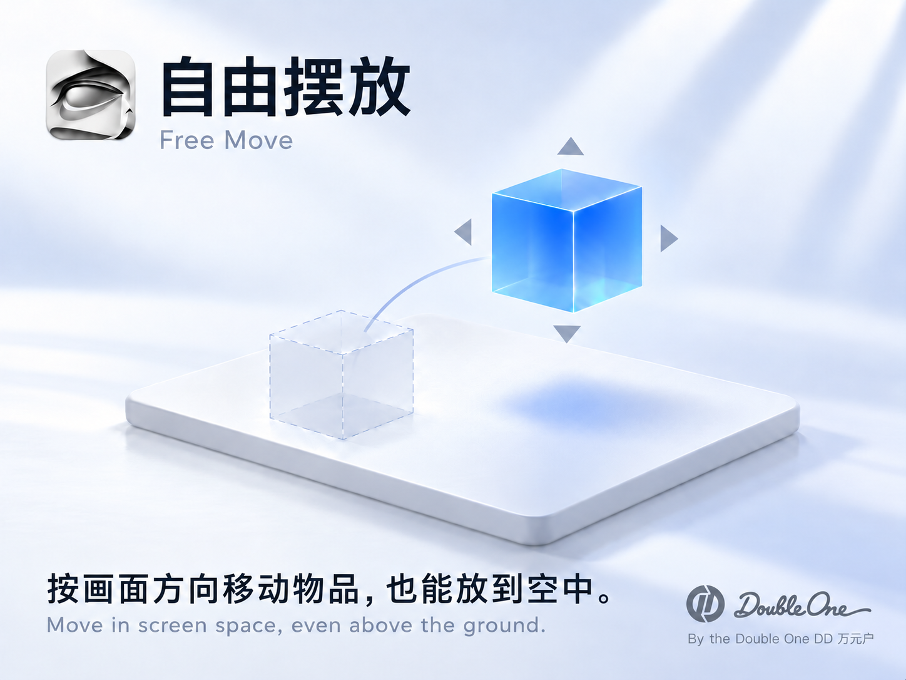

[简体中文](README.md) · **English**


**[Download for Mac](https://github.com/wangyinhe3939/PinDDD/releases/download/v1.0.0-preview.1/PinDDD.dmg)** · macOS 14+ · Apple Silicon / Intel · 7.2 MB

This preview is ad-hoc signed and not notarized. If macOS blocks the first launch, see [Apple's instructions](https://support.apple.com/en-us/102445).

<p align="center">
  <a href="assets/features/free-move.png"></a>
  <a href="assets/features/surface-snap.png"></a>
  <a href="assets/features/layout-export.png"></a>
</p>

<details>
<summary>Usage and development</summary>

- Import GLB / OBJ and other supported formats. Click to pick up or place a model; Esc cancels. Move freely above the ground, or switch to surface snapping to stack models.
- Right-drag to orbit; Space + left-drag to pan. Use [ / ] for uniform scaling. The object menu provides cloning, locking, mirroring and deletion.
- ⌘S saves a complete .pinddd project. Blender layout JSON uses meters, Z-up, world coordinates and radians; it exports placement data, so keep model assets separately.
- The core editor works offline. The app UI is currently in Simplified Chinese. iPad / iPhone requires iOS 17+ and your own development signing; real-device validation is pending.

**Web editor** — Python 3.9+ and a WebGL 2 browser:

```sh
git clone https://github.com/wangyinhe3939/PinDDD.git ~/Developer/PinDDD
cd ~/Developer/PinDDD
python3 serve.py
```

Open http://127.0.0.1:7951/editor/ . Press Ctrl+C to stop.

**Native app** — Open PinDDD.xcodeproj in Xcode and select PinDDD-Mac or PinDDD-iOS. Set your own Team and Bundle Identifier for iOS.

**DMG packaging** — Full Xcode and Python 3.10+:

```sh
python3 -m venv .build_tmp/packaging-env
.build_tmp/packaging-env/bin/python -m pip install -r Packaging/requirements.txt
PATH="$PWD/.build_tmp/packaging-env/bin:$PATH" python3 scripts/package.py
```

Deliveries go to outputs; packaging stops if they already exist. Build and test caches stay in .build_tmp. Each step has a 15-second deadline; inspect the log after a timeout. Checks live in Tests; browser checks require an existing Node.js, Playwright and Chrome installation.

</details>

Built on [Three.js Editor](https://github.com/mrdoob/three.js/tree/r186/editor) · [MIT](LICENSE) · [Third-party licenses](vendor/THIRD_PARTY_NOTICES.txt)
