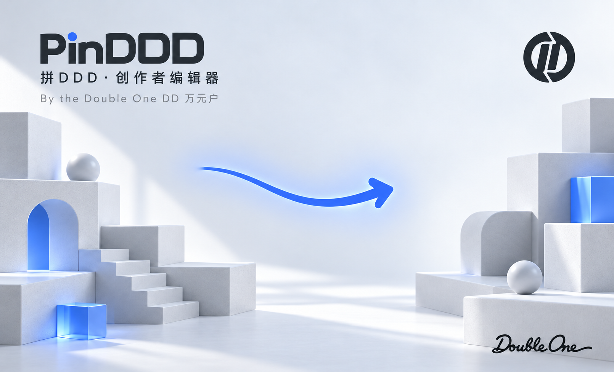

# 拼DDD · 创作者编辑器

**By the Double One DD 万元户**

基于官方 [Three.js Editor r186](https://github.com/mrdoob/three.js/tree/r186/editor) 定制的中文 3D 场景拼装工具。拖入模型、自由摆放或吸附堆叠，再保存项目或导出 Blender 坐标。原生 JavaScript + 本地 Three.js，Mac / iPad 容器使用 SwiftUI + WKWebView，编辑主流程离线运行。

[下载 Mac 安装包](https://github.com/wangyinhe3939/PinDDD/releases) · [MIT 许可](LICENSE)



## 安装与使用

- **Mac：** macOS 14 或更高版本，Apple Silicon / Intel。下载 Release 中的「拼DDD.dmg」，打开后将 PinDDD 拖到 Applications。
- **签名状态：** 当前是本机 ad-hoc 签名的预览版，尚无 Developer ID 和 Apple 公证。macOS 可能阻止首次打开；核实下载来源后按 [Apple 官方说明](https://support.apple.com/en-us/102445) 操作，或自行从源码构建。
- **iPad / iPhone：** iOS / iPadOS 17 或更高版本。提供原生工程，需要在 Xcode 选择自己的开发团队和 Bundle Identifier 后运行；不公开分发包含个人设备信息的开发签名 App。真机安装与性能尚未完成验收。

画布默认「自由移动 · 可离地」：单击整个模型抓起，鼠标上下左右对应画面方向，保持相机深度；再次单击放下，Esc 取消。切换「吸附摆放 · 贴表面」后可贴地、放在桌面或堆叠模型，默认网格步长 0.1 米。

| 操作 | Mac | iPad |
| --- | --- | --- |
| 抓起 / 放下 | 左键单击 | 单指点按 |
| 旋转视角 | 右键拖动 | 单指拖动空白处 |
| 平移 / 镜头缩放 | 空格 + 左键 / 未抓取时滚轮 | 双指拖动 / 捏合 |
| 物品旋转 | 抓取时滚轮，Shift 精调；R 使用自定角度 | 左下角旋转按钮 |
| 等比大小 | [ / ] 或右侧比例输入 | 缩小 / 放大或比例输入 |
| 物品菜单 | 右键单击 | 长按 0.5 秒 |

- 右上角六向陀螺可拖动环绕，导航按钮可平移、缩放、居中；机位栏提供鸟瞰 / 顶视 / 正视 / 侧视。
- 以整个模型根组操作，保留层级；支持撤销、克隆、删除、镜像、锁定、重新贴地及材质编辑。Option / Alt 点击可复制后直接摆放。
- 导入 GLB / GLTF / OBJ 等；本地 Draco / KTX2 / Meshopt 资源随包附带。大模型显示读取进度，解析同步片段结束后才能响应取消。
- Mac ⌘S 保存完整 .pinddd 项目，⌘⇧S 另存，⌘O 打开，支持最近项目。保存失败可重试，关闭前检查写入结果；渲染进程异常后可恢复最近一次完整快照，最后未保存的操作可能丢失。
- Blender 布局 JSON 为米制、Z-Up、世界坐标与 XYZ 欧拉弧度：位置映射 (x, -z, y)。包含 name / position / rotation / scale / parent / id / matrix；有剪切变换时以列主序世界矩阵为准。模型资源需单独保存，布局 JSON 不能替代完整项目。
- 资产补给站保存个人网站书签；点击外站需要网络。主画布持续渲染，未加入空闲停帧逻辑，复杂模型性能取决于设备与素材。

## 本地网页版

需要 Python 3.9+ 与支持 WebGL 2 的现代浏览器。无需 npm 安装或前端打包：

```sh
mkdir -p ~/Developer
cd ~/Developer
git clone https://github.com/wangyinhe3939/PinDDD.git
cd PinDDD
python3 serve.py
```

打开 http://127.0.0.1:7951/editor/ ，Ctrl+C 停止；加 --port 7952 可换端口。必须通过 HTTP 访问，浏览器的 file:// 模块加载受限。自动保存位于当前浏览器的 IndexedDB；App 使用 Application Support 中的恢复文件。

## 原生构建

打开 PinDDD.xcodeproj，选择 PinDDD-Mac / My Mac 或 PinDDD-iOS / 已连接设备。iOS 的 Signing & Capabilities 需选择自己的团队和唯一 Bundle Identifier。两端共用 Native 源码与现有 Web 目录，没有另一份前端副本。

Mac 安装盘使用 [dmgbuild](https://github.com/dmgbuild/dmgbuild) 直接生成 Finder 布局，无需打开 Finder。这些 Python 库只供开发时打包，不进入 App：

```sh
python3 -m venv .build_tmp/packaging-env
.build_tmp/packaging-env/bin/python -m pip install -r Packaging/requirements.txt
PATH="$PWD/.build_tmp/packaging-env/bin:$PATH" python3 scripts/package.py
```

打包环境需要 Python 3.10+ 和完整 Xcode。Release 同时编译 arm64 / x86_64；产物是 outputs/PinDDD.app 和 outputs/拼DDD.dmg。已有交付物时脚本停止，确认新候选可用后再把旧交付移入废纸篓。--dmg-only 可使用 .build_tmp/DerivedData 中已构建的 Release。

iPad：python3 scripts/build-ipad.py；调试构建加 --configuration Debug，指定设备加 --device UDID。开发证书有效期、设备名额和安装权限由自己的 Apple 开发账号决定。

脚本要求工程位于 ~/Developer，测试与构建缓存集中在 .build_tmp。每个受控步骤最多 15 秒；冷构建可能超时，日志保留供检查后手动续作，不自动无限重试。

## 检查

无窗口浏览器检查需要已安装的 Node.js、Playwright 与 Google Chrome，仅用于开发：

```sh
NODE_PATH=<已安装的模块目录> python3 scripts/run.py -- node Tests/editor.cjs
NODE_PATH=<已安装的模块目录> python3 scripts/run.py -- node Tests/editor.cjs --resources
NODE_PATH=<已安装的模块目录> python3 scripts/run.py -- node Tests/free-move.cjs
```

只读挂载安装盘后，可用打包环境的 Python 执行 Tests/package.py <挂载点> <原始App路径>，检查 Finder 布局、背景引用、链接、文件哈希和签名。

Tests 还包含交互、触控、相机、导航、变换、保存、导入和原生 WKWebView 检查。系统检查不等于真实 iPad、iCloud 文件面板或大型复杂场景的体验保证。

## 来源与许可

本项目的原创修改以 MIT 许可开放，保留 three.js 作者版权。上游版本为 r186（提交 9b4a2ac29c63ccb43fd51c5661f2f873ac2c39b8）；仅保留编辑器现有功能使用的扩展，未包含全部官方示例。

第三方组件保留各自许可，详见 [第三方声明](vendor/THIRD_PARTY_NOTICES.txt)、vendor 下的 LICENSE、Lucide 图标及字体目录内的许可。本仓库不含个人项目存档、开发证书或构建缓存。
