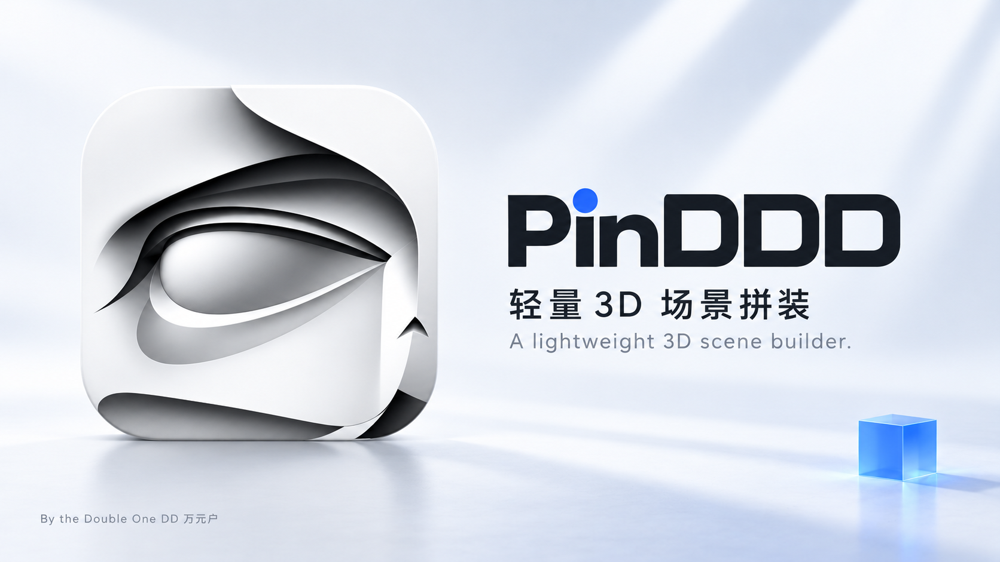

**简体中文** · [English](README.en.md)



**[下载 Mac 版](https://github.com/wangyinhe3939/PinDDD/releases/download/v1.0.0-preview.1/PinDDD.dmg)** · macOS 14+ · Apple Silicon / Intel · 7.2 MB

当前为本机签名预览版，尚未公证。首次打开受阻时，请参考 [Apple 说明](https://support.apple.com/en-us/102445)。

<details>
<summary>使用与开发</summary>

- 导入 GLB / OBJ 等模型，单击抓起、再次单击放下，Esc 取消；自由移动允许离地，切到吸附模式即可堆叠。
- 右键拖动转动视角，空格 + 左键平移；[ / ] 等比缩放。物品菜单提供复制、锁定、镜像和删除。
- ⌘S 保存完整 .pinddd 项目。Blender 布局 JSON 使用米、Z-Up、世界坐标和弧度；只导出摆放数据，模型资源需另存。
- 主要编辑功能离线运行。App 界面目前为简体中文；iPad / iPhone 需 iOS 17+，使用自己的开发团队签名，真机验收尚未完成。

**本地网页版** — Python 3.9+，支持 WebGL 2 的浏览器：

```sh
git clone https://github.com/wangyinhe3939/PinDDD.git ~/Developer/PinDDD
cd ~/Developer/PinDDD
python3 serve.py
```

打开 http://127.0.0.1:7951/editor/ ，Ctrl+C 停止。

**原生 App** — 用 Xcode 打开 PinDDD.xcodeproj，选择 PinDDD-Mac 或 PinDDD-iOS。iOS 需设置自己的 Team 和 Bundle Identifier。

**打包 DMG** — 完整 Xcode、Python 3.10+：

```sh
python3 -m venv .build_tmp/packaging-env
.build_tmp/packaging-env/bin/python -m pip install -r Packaging/requirements.txt
PATH="$PWD/.build_tmp/packaging-env/bin:$PATH" python3 scripts/package.py
```

交付位于 outputs；已有文件时脚本会停止。构建与检查缓存位于 .build_tmp，各步骤限时 15 秒，超时后先查看日志。开发检查入口为 Tests；浏览器检查需要已有的 Node.js、Playwright 和 Chrome。

</details>

基于 [Three.js Editor](https://github.com/mrdoob/three.js/tree/r186/editor) · [MIT](LICENSE) · [第三方许可](vendor/THIRD_PARTY_NOTICES.txt)
